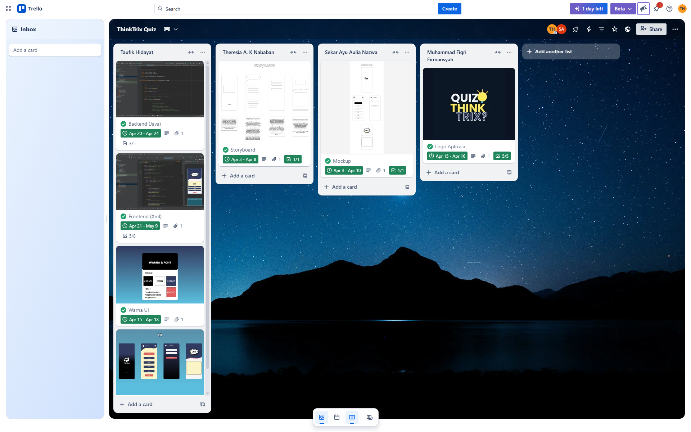

# Pemograman Mobile 2
| Kelompok 14 |  Pemrograman Mobile 2  | Nama |  NIM | Dosen |
|-------|---------|----------|------|-----|
| Kelas | TI.23.A6 |  Taufik Hidayat (Trello Individu) : https://trello.com/b/ZKQvWUXs/thinktrix| 312310576  | Donny Maulana, S.Kom., M.M.S.I.|
| Kelas | TI.23.A6 |  Theresia A. K Nababan | 312310670|
| Kelas | TI.23.A6 |  Sekar Ayu Aulia Nazwa | 312310654 |
| Kelas | TI.23.A6 | Muhammad Fiqri Firmansyah | 312310629 |
| Link Trello Kelompok | https://trello.com/b/cgFsvDQA/thinktrix-quiz| 
## Trello kelompok

## Storyboard

#### 1. Splashscreen
Aplikasi "ThinkTrix" dimulai dengan menampilkan layar pembuka yang menarik. Pada layar ini, pengguna akan melihat logo "ThinkTrix" dengan kata "QUIZ" yang menonjol di latar belakang gelap. Di bagian bawah layar terdapat informasi "Version 1.0" yang menandakan ini adalah versi pertama dari aplikasi.

#### 2. Halaman Utama / Data Level
Setelah beberapa saat, pengguna akan dibawa ke menu utama. Di sini, nama pengguna ditampilkan di bagian atas bersama dengan ikon profil, memberikan sentuhan personal pada pengalaman pengguna. Di sebelah kanan terdapat ikon roda gigi untuk mengakses pengaturan. Bagian utama layar menampilkan lima pilihan level yang tersusun rapi dari atas ke bawah. Level 1 ditandai dengan warna merah, menunjukkan bahwa ini adalah tingkat awal yang harus diselesaikan terlebih dahulu, sementara Level 2 hingga Level 5 ditampilkan dalam warna biru tua. Di bagian bawah terdapat tombol "Start" berwarna merah yang mengundang pengguna untuk memulai permainan.

#### 3. Settings
Jika pengguna menekan ikon roda gigi, mereka akan dibawa ke layar pengaturan. Layar ini memiliki desain yang lebih sederhana dengan dua bidang input yang memungkinkan pengguna untuk menyesuaikan preferensi mereka, mungkin untuk mengubah nama pengguna atau pengaturan lainnya. Terdapat tombol kembali di bagian atas untuk kembali ke layar sebelumnya, dan tombol "Exit Application" berwarna merah di bagian bawah untuk keluar dari aplikasi.

#### 4. Halaman Quiz
Saat pengguna memulai kuis, mereka akan melihat layar pertanyaan. Layar ini memiliki kata "QUIZ" yang ditampilkan dalam grafik gaya komik yang menarik perhatian. Di bawahnya terdapat area persegi panjang berwarna kuning yang akan menampilkan pertanyaan kuis. Elemen desain bergelombang memisahkan bagian header dari konten, menciptakan tampilan yang dinamis dan menarik.

## Mock up

## Warna UI

## UI Design

# On going project
